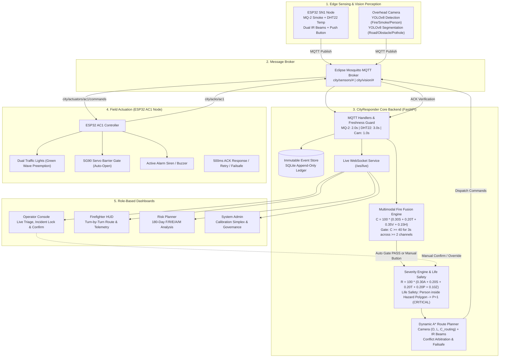
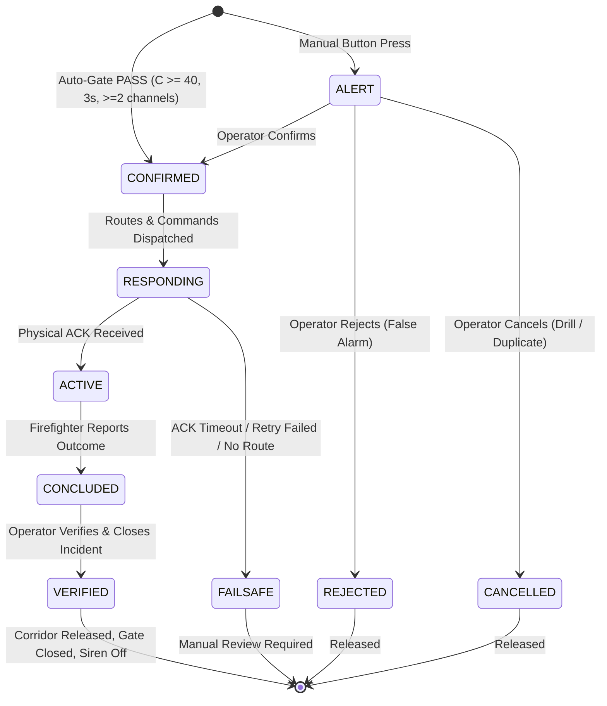

# CityResponder

<p align="center">
  <b>Autonomous urban emergency dispatch system featuring multi-sensor fire fusion, YOLOv8 vision perception, dynamic A* hazard-aware routing with dual-IR conflict resolution, and physical ESP32 IoT actuators with an immutable audit ledger.</b>
</p>

<p align="center">
  
  
  
  
  
  
</p>

---

## Table of Contents

- [Track & Problem Statement](#track--problem-statement)
- [Introduction](#introduction)
- [Live Deployment & Verification Status](#live-deployment--verification-status)
- [System Flow](#system-flow)
- [System Architecture](#system-architecture)
- [Core Features](#core-features)
- [User Roles & Workflows](#user-roles--workflows)
- [IoT & Hardware Architecture](#iot--hardware-architecture)
- [Automation & Decision Logic](#automation--decision-logic)
- [Technical Stack](#technical-stack)
- [Installation & Setup](#installation--setup)
- [Environment Variables](#environment-variables)
- [Controlled Simulation & Testing](#controlled-simulation--testing)
- [API Reference](#api-reference)
- [Project Structure](#project-structure)
- [Real-Life Deployment Budget](#real-life-deployment-budget)
- [Project Materials & Audit Evidence](#project-materials--audit-evidence)
- [Future Improvements](#future-improvements)
- [Team Contributions](#team-contributions)
- [Notes for Evaluators & Judges](#notes-for-evaluators--judges)

---

## Track & Problem Statement

**Domain:** Smart City Infrastructure, Intelligent Transportation Systems (ITS) & Urban Emergency Response  
**Solution Type:** Full-Stack IoT Platform + Computer Vision Pipeline + Event-Sourced Backend + Real-Time Operational Dashboard + Physical Tabletop Actuation  

Municipal emergency dispatch and fire response systems face critical operational bottlenecks:

1. **Siloed & Unreliable Sensor Feeds:** Smoke detectors (e.g. MQ-2) and thermal sensors (DHT22) suffer from drift, ambient false alarms, and communication dropouts. Relying on a single sensor triggers costly false dispatches, while requiring manual verification delays response times during life-critical window periods.
2. **Blind Spot Hazard Navigation:** Emergency vehicles navigating urban corridors encounter unmapped road obstacles, flooding, road cave-ins, and severe congestion. Traditional navigation apps update too slowly, leading responders directly into dead ends or blocked thoroughfares.
3. **Absence of Coordinated Physical Infrastructure:** Even when an incident is dispatched, traffic signals remain uncoordinated, and physical facility barriers/gates remain closed, stalling fire trucks and ambulances during ingress.
4. **Lack of Immutable Accountability & Downstream Learning:** Post-incident audits and municipal risk mapping frequently rely on disputed manual reports. Without tamper-evident, append-only logs capturing raw sensor telemetry, AI bounding boxes, operator actions, and actuator ACKs, cities cannot objectively verify response SLA or perform adaptive model calibration.

**CityResponder** solves these challenges through a unified, closed-loop urban emergency orchestration platform:
- **Multimodal Fusion Engine:** Integrates physical smoke and heat sensing, overhead YOLOv8 computer vision, temporal consistency, and 180-day historical area risk into a calibrated confidence score ($C$).
- **Life-Safety Person-in-Hazard Escalation:** Features single-frame YOLO person detection inside calibrated building hazard polygons, immediately overriding incident severity to **Critical** to protect human life.
- **Dynamic Hazard-Aware A\* Routing:** Combines live road obstacle and pothole segmentation with dual-beam IR sensors, automatically resolving sensor-camera conflicts and rerouting responders in sub-millisecond compute time.
- **Physical Actuator Integration (AC1 Node):** Preempts urban traffic with a green wave corridor, opens physical servo barrier gates, and triggers emergency sirens with guaranteed 500 ms ACK timeouts and safe-default failsafes.
- **Immutable Event-Sourced Ledger:** Enforces tamper-evident accountability where every state transition, camera snapshot hash, and operator command is permanently recorded for forensic review, 180-day risk heatmaps, and bounded simplex calibration.

---

## Introduction

CityResponder operates as a real-time, deterministic emergency response feedback loop:

```text
[SN1 Sensor Node (MQ-2, DHT22, Button, IR-A, IR-B)] + [Overhead Camera (YOLOv8)]
                               │
                       Eclipse Mosquitto
                       (MQTT Broker)
                               │
                    FastAPI Event Engine
             ┌─────────────────┴─────────────────┐
      Multimodal Fire Fusion            Severity Assessment
   (S_fusion, T_temporal, V, H)       (A, S_smoke, T_heat, P, Z)
             └─────────────────┬─────────────────┘
                               │
               Dynamic A* Hazard Route Planner
           (Camera Segmentation vs Dual-IR Arbitration)
                               │
             ┌─────────────────┴─────────────────┐
     Live WebSocket Push               Actuator Command Engine
(React Dashboard: Operator /                 (AC1 Node via MQTT)
 Firefighter / Planner / Admin)                  │
             │                         Dual Traffic Lights (Green Wave)
      Immutable SQLite                 SG90 Barrier Gate (OPEN)
        Event Ledger                   Alarm Siren (BUZZER ON)
             │                                   │
   180-Day Area Risk Map               Physical ACK Verification
   & Adaptive Brier Calibration        (500ms Timeout -> Failsafe)
```

The system provides dedicated, role-tailored workflows:
- **Emergency Operator:** Live incident queue, real-time sensor/camera inspection, manual ALERT confirmation/rejection, and manual green-corridor dispatch override.
- **Field Firefighter:** Turn-by-turn routing HUD, live road obstruction status, building environment telemetry (temperature, smoke), and post-incident preliminary conclusion reporting.
- **City Risk Planner:** 180-day rolling area risk intelligence ($F, R, E, A, M$ decomposition), incident frequency analytics, and urban infrastructure vulnerability planning.
- **System Administrator:** Calibration model governance (preview, approve, rollback bounded simplex weights), user RBAC access control, and sensor freshness threshold tuning.

---

## Live Deployment & Verification Status

| Resource | Scope / Access | Status |
|---|---|---|
| **Local Web Dashboard** | `http://localhost:5173` (Vite / React 18) | Verified Stable |
| **Backend REST API** | `http://127.0.0.1:8010` (FastAPI / Uvicorn) | Verified Stable |
| **Interactive API Documentation** | `http://127.0.0.1:8010/docs` (Swagger UI) | 29/29 Endpoints Verified |
| **Live Streaming Channel** | `ws://127.0.0.1:8010/ws/live?token=<JWT>` | Real-Time Sync Verified |
| **MQTT Broker** | `localhost:1883` (Eclipse Mosquitto) | Wire Protocol Active |
| **Controlled Routing Benchmark** | 150/150 cycles under 1.0s (Median 0.055 ms) | **PASS** (`reports/validation/step18_response_timing.md`) |
| **Controlled Dashboard Latency** | 10/10 samples under 1.0s (Median 612 ms) | **PASS** (`reports/validation/step16_manual_live_latency.json`) |
| **End-to-End E2E Lifecycle** | Scenarios A, B, C under controlled fixtures | **PASS** (`reports/validation/step17_e2e_cycle.md`) |
| **Software Deep Audit** | 328 requirements audited; 251 PASS, 0 FAIL | **FROZEN / ZERO FAIL** (`reports/validation/final_deep_audit.md`) |

---

## System Flow



---

## System Architecture

```mermaid
flowchart LR
    subgraph EDGE_LAYER["Edge & IoT Layer"]
        SN1_NODE["ESP32 SN1 (Sensor Node)\n- MQ-2 Smoke\n- DHT22 Temperature\n- IR Sensors 1 & 2\n- Emergency Button"]
        AC1_NODE["ESP32 AC1 (Actuator Node)\n- Traffic Lights 1 & 2\n- Active Alarm Buzzer\n- SG90 Servo Gate"]
        VISION_SRC["Overhead Camera (1080p)\n- YOLOv8 Object Detection\n- YOLOv8 Road Segmentation"]
    end

    subgraph COMM_LAYER["Communications & Security"]
        MOSQUITTO["Eclipse Mosquitto (MQTT 1883)\n- Quality of Service (QoS 0/1)\n- Last Will & Testament (LWT)"]
        JWT_AUTH["Role-Based JWT Security\n- HS256 Token Auth\n- Strict RBAC per Route"]
    end

    subgraph CORE_LAYER["Backend Intelligence Services (FastAPI)"]
        EVENT_BUS["Event-Sourcing Engine"]
        FUSION_MOD["Fire Fusion Engine"]
        SEV_MOD["Severity Assessment"]
        ROUTE_MOD["A* Hazard Routing"]
        RISK_MOD["180-Day Area Risk"]
        CALIB_MOD["Adaptive Brier Calibration"]
    end

    subgraph PERSISTENCE["Storage & Evidence Ledger"]
        DB[("SQLite Database\n- Append-Only Events\n- Incident Projections\n- User Credentials")]
        EVIDENCE_STORE["Tamper-Evident Evidence Store\n- Max 5 Frames / Incident\n- SHA-256 Checksum Verification\n- 180-Day Retention"]
    end

    subgraph UI_LAYER["React 18 / TypeScript Web Application"]
        DASH_OP["Operator Incident Console"]
        DASH_FF["Firefighter Response View"]
        DASH_RP["Risk Planner Analytics"]
        DASH_ADMIN["Admin Calibration Governance"]
    end

    EDGE_LAYER <-->|MQTT Topics| COMM_LAYER
    COMM_LAYER <--> CORE_LAYER
    CORE_LAYER <--> PERSISTENCE
    CORE_LAYER <-->|WebSocket & REST API| UI_LAYER
```



### Architecture Layers

1. **Edge Sensing & Vision Perception Layer:** Dual ESP32 DevKit V1 microcontrollers operate independently over 2.4 GHz Wi-Fi. SN1 ingests analog smoke, digital ambient temperature, dual IR barrier beams, and an emergency manual push button. The overhead vision pipeline ingests 1080p frames at 30 FPS, applying custom YOLOv8 models for real-time bounding box detection and pixel-level semantic segmentation.
2. **Communications & Messaging Layer:** Eclipse Mosquitto coordinates asynchronous, low-latency publish-subscribe traffic. A dual-heartbeat and Last Will and Testament (LWT) mechanism guarantees instant fail-safe state triggering if network connection drops.
3. **Core Backend Intelligence Layer:** Built on FastAPI (Python 3.11) with SQLAlchemy ORM and Pydantic v2 validation. Incorporates mathematical normalization, temporal sliding windows, geometric polygon containment, and A\* pathfinding.
4. **Immutable Persistence & Evidence Layer:** Strict event-sourcing paradigm where no historical event or reading is ever overwritten. Stored evidence frames are cryptographically hashed using SHA-256 and purged automatically after 180 days under strict administrative audit policies.
5. **Presentation & Operational Dashboard Layer:** Built on React 18, Vite, and TypeScript with native WebSocket live streaming, delivering synchronized UI updates across all four municipal roles in under 1 second.

---

## Core Features

### 1. Multimodal Fire Fusion Engine

CityResponder fuses physical IoT telemetry, deep-learning vision inferences, and historical records into a normalized confidence score:

$$\mathbf{C} = 100 \times (0.30 S_{\text{fusion}} + 0.20 T_{\text{temporal}} + 0.35 V + 0.15 H)$$

- **Normalized Sensor Score ($S_{\text{fusion}}$):** Computes $\max(s_{\text{smoke}}, s_{\text{heat}})$.
  - DHT22 (Temperature): Baseline $30^\circ\text{C}$, Alarm $50^\circ\text{C}$, clamped to $[0, 1]$. Stale after 3.0 s.
  - MQ-2 (Smoke): Baseline 500, Alarm 2000 (0–4095 ADC scale), clamped to $[0, 1]$. Stale after 2.0 s with 60 s power-on warm-up isolation.
  - Fault tolerance: If one sensor goes stale, the system gracefully falls back to the active channel.
- **Temporal Consistency ($T_{\text{temporal}}$):** Evaluates hazard persistence across the last three 1-second sliding windows:
  $$T_{\text{temporal}} = \frac{\text{Windows with Valid Evidence}}{3}$$
  A window is valid if $S_{\text{fusion}} \ge 0.20$, $V \ge 0.50$, or the manual button was depressed.
- **Vision Score ($V$):** Evaluates YOLOv8 detection bounding boxes inside the building Region of Interest (ROI):
  $$V = \max(\text{Confidence}_{\text{fire}}, \text{Confidence}_{\text{smoke}})$$
  Excludes overlapping double-counting and enforces a strict 1.0 s freshness limit.
- **Historical Area Baseline ($H$):** Integrates 180-day verified historical risk:
  $$H = \frac{\text{Area Risk Score}}{100}$$
- **Strict Auto-Confirmation Gate:** The backend automatically confirms an incident only when:
  $$C \ge 40 \quad \text{for 3 consecutive 1-second windows, supported by } \ge 2 \text{ independent channels}$$
  Valid supporting channels require $s_{\text{smoke}} \ge 0.30$, $s_{\text{heat}} \ge 0.30$, $V \ge 0.30$, or Manual Button $= 1.0$.

### 2. Severity Scoring & Life-Safety Person Override

Once an incident is confirmed, CityResponder computes the Resource Severity Score ($R$):

$$\mathbf{R} = 100 \times (0.30 A + 0.20 S_{\text{smoke}} + 0.20 T_{\text{heat}} + 0.20 P + 0.10 Z)$$

- **Fire Extent ($A$):** Calculated via pixel ratio:
  $$A = \min\left(\frac{\text{Fire Bounding Box Area}}{\text{Hazard Zone Polygon Area}}, 1.0\right)$$
- **Decoupled Telemetry ($S_{\text{smoke}}, T_{\text{heat}}$):** Severity explicitly decouples smoke and temperature scores to prevent double-counting thermal data.
- **Life-Safety Person Override ($P$):** Evaluates whether a person is trapped within the hazard polygon zone:
  - If YOLOv8 detects a person with confidence $\ge 0.50$ whose center coordinate falls within the hazard polygon, **$P = 1$ is triggered instantly on the very first frame**.
  - **Critical Life-Safety Rule:** When $P = 1$, the severity is forced to **Critical ($R \ge 70$)**, immediately assigning maximum rescue resources regardless of fire size.
- **Zone Vulnerability ($Z$):** Constant structural risk factor configured per zone (Low $= 0.30$, Normal $= 0.60$, High $= 1.00$).

### 3. Dynamic Hazard-Aware Routing & Conflict Resolution

CityResponder models the urban tabletop road network as a weighted directional graph and calculates the optimal response path via A\*:

$$\text{Cost}_{\text{edge}} = \text{Distance}_{\text{cm}} \times \left(1 + 4 \times [0.70 O + 0.20 L + 0.10 C_{\text{routing}}]\right)$$

*(Formula: `edge_cost = distance_cm * (1 + 4 * (0.70 * O + 0.20 * L + 0.10 * C_routing))`)*

- **Obstacle Ratio ($O$):** Derived from YOLOv8 semantic segmentation: $\frac{\text{Obstacle Mask Pixels}}{\text{Road ROI Pixels}}$, smoothed over a 3-frame median filter ($\approx 1.5$ s).
- **Obstacle Length ($L$):** $\min\left(\frac{\text{Obstacle Length along Road Axis}}{\text{Road Length}}, 1.0\right)$ calibrated via ArUco markers.
- **Road Condition ($C_{\text{routing}}$):** Proportion of potholes or surface degradation within the road corridor.
- **Dual-Beam IR Sensor Fusion:** `IR-A` (Route A) and `IR-B` (Route B) sample road clearance every 200 ms. An obstacle is confirmed when 5 consecutive samples are blocked (1.0 s debounce).
- **Camera vs. IR Conflict Arbitration:**
  - `Camera BLOCKED` ($O \ge 0.80$) + `IR BLOCKED` $\implies$ **BLOCKED** (edge pruned from graph).
  - `Camera CLEAR` ($O < 0.20$) + `IR CLEAR` $\implies$ **OPEN** (passable).
  - `Camera MIDDLE` ($0.20 \le O < 0.80$) $\implies$ Passable with elevated traversal cost.
  - `Disagreement` (e.g. Camera Clear but IR Blocked) $\implies$ The system holds for 1.5 s; if disagreement persists, it flags `SENSOR_CONFLICT`, prunes the edge for responder safety, and alerts the Operator.
- **Sub-Millisecond A\* Performance:** Step 18 controlled benchmarks prove median route computation takes **0.055 ms** (p95: 0.108 ms), completing 150/150 reroutes in $<1$ ms.

### 4. Physical IoT Actuation & Traffic Corridor Preemption

The AC1 Actuator Node controls physical infrastructure on the smart city tabletop:

- **High / Critical Incidents:**
  - **Traffic Light Corridor (TL1 & TL2):** Preempts civilian traffic with a green wave for emergency responders (`GREEN_CORRIDOR`).
  - **SG90 Barrier Gate:** Automatically actuates from 0° (Closed) to 90° (Open) to grant facility access.
  - **Emergency Buzzer:** Sounds an active audible alert to clear pedestrians and cross traffic.
- **Low / Medium Incidents:** Dispatches responder units on dashboard screens only; physical traffic lights and barriers remain unaffected to prevent unnecessary urban disruption.
- **500 ms ACK Watchdog & Safe-Default Failsafe:**
  - AC1 must return an MQTT acknowledgement within 500 ms.
  - If unacknowledged, exactly one retry is dispatched.
  - On second timeout or `NO_SAFE_ROUTE`, AC1 triggers the **Safe Default**: Traffic Lights turn **ALL_RED**, Barrier Gate **CLOSES**, and Buzzer turns **ON**.
  - A mandatory 1000 ms transition interval is enforced during signal switching to ensure safety clearance.

### 5. Immutable Event Sourcing & Audit Ledger

CityResponder implements an enterprise append-only event sourcing architecture:
- Every sensor reading, vision inference, operator triage verdict, route calculation, dispatch action, actuator command, and hardware ACK is appended as an immutable record in SQLite.
- Events cannot be updated, edited, or deleted through the API.
- Live state projections (such as active incidents, current sensor readings, and actuator states) are deterministically rebuilt directly from event history.

### 6. Tamper-Evident Evidence Retention

- **Privacy-First Design:** CityResponder strictly prohibits continuous video recording. Only up to **5 annotated keyframe images** are retained per incident.
- **Cryptographic Verification:** Each stored frame is hashed with **SHA-256** and referenced in the immutable database ledger.
- **Retention Lifecycle:** Evidence is retained for 180 days (matching the Area Risk calculation window). Automatic daily background jobs purge expired images while preserving audit metadata indefinitely.

### 7. Incident Lifecycle & Downstream Verification

CityResponder enforces a strict state machine to prevent race conditions:



- **Downstream Learning Rules:**
  - Only incidents closed as `VERIFIED_FIRE` by the Operator are eligible for the 180-day Area Risk score and positive calibration labels ($y = 1$).
  - Incidents closed as `REJECTED` or `VERIFIED_FALSE_ALARM` after physical dispatch feed the false-dispatch penalty metric ($y = 0$).
  - `CANCELLED` drills and duplicates are excluded from machine learning sets.

### 8. Area Risk Intelligence Engine

City Risk Planners monitor a rolling 180-day transparent weighted risk score across municipal sectors:

$$\text{Area Risk Score} = 100 \times (0.30 F + 0.25 R + 0.20 E + 0.15 A + 0.10 M)$$

- **Frequency ($F$):** Normalized incident frequency compared to the highest-incident sector in the city.
- **Recency ($R$):** Linear decay: $\max(0, 1 - d/180)$, where $d$ is days elapsed since the latest verified fire.
- **Escalation ($E$):** Average historical severity score ($R/100$) of verified fires in that area.
- **Access Difficulty ($A$):** Proportion of past dispatches where routes suffered road blockages, conflicts, or required dynamic rerouting.
- **Mitigation Readiness ($M$):** Density of operational hydrants and secondary access lanes.

### 9. Adaptive Brier Calibration & Governance

CityResponder avoids unpredictable deep-learning retraining by calibrating the four linear fusion weights ($S, T, V, H$) using bounded convex optimization:

- **Loss Function:** Mean Squared Error (Brier Score) over a balanced dataset of 30 training outcomes (15 fires, 15 non-fires):
  $$L(\mathbf{w}) = \frac{1}{n} \sum_{i=1}^{n} (\mathbf{w} \cdot \mathbf{x}_i - y_i)^2$$
- **Simplex Gradient Step:** Applies gradient descent with learning rate $\eta = 0.02$, followed by Euclidean projection onto the bounded simplex:
  $$0.10 \le w_i \le 0.50, \quad \sum_{i=1}^{4} w_i = 1.00$$
- **Admin Governance & Instant Rollback:** New calibration candidates must be validated against 15 separate outcomes (8 fires, 7 non-fires). Candidates cannot go live automatically; the System Administrator must inspect the validation delta, approve the version, or trigger an instantaneous rollback to any previous version.

---

## User Roles & Workflows

CityResponder features four distinct role-based access control (RBAC) personas:

```
┌────────────────────────────────────────────────────────────────────────┐
│                        CITYRESPONDER RBAC MATRIX                       │
├─────────────────────┬──────────┬─────────────┬──────────────┬──────────┤
│ Page / Capability   │ OPERATOR │ FIREFIGHTER │ RISK_PLANNER │  ADMIN   │
├─────────────────────┼──────────┼─────────────┼──────────────┼──────────┤
│ Overview Dashboard  │    ✓     │      -      │      -       │    ✓     │
│ Incident Triage     │    ✓     │      ✓      │      -       │    ✓     │
│ Manual Dispatch/Lock│    ✓     │      -      │      -       │    -     │
│ Response HUD/Routing│    ✓     │      ✓      │      -       │    ✓     │
│ Conclude Incident   │    -     │      ✓      │      -       │    -     │
│ Verify & Close Fire │    ✓     │      -      │      -       │    -     │
│ 180-Day Risk Intel  │    -     │      -      │      ✓       │    ✓     │
│ Evidence Retention  │    ✓     │      ✓      │      ✓       │    ✓     │
│ Freshness Tuning    │    -     │      -      │      -       │    ✓     │
│ Calibration Admin   │    -     │      -      │      -       │    ✓     │
│ User Management     │    -     │      -      │      -       │    ✓     │
└─────────────────────┴──────────┴─────────────┴──────────────┴──────────┘
```

### 1. Emergency Operator Workflow
1. Monitors the live municipal queue on `/` and `/incidents`.
2. Receives instantaneous visual alerts when a manual button or sensor threshold triggers.
3. Examines live camera feeds, bounding boxes, smoke/heat levels, and suggested severity $R$.
4. Confirms the incident with a written reason (or overrides severity if $R$ is missing).
5. If the automated 3-window gate fires first, the incident auto-locks, preventing duplicate manual confirmation while preserving operator override capabilities.

### 2. Field Firefighter Workflow
1. Logs into `/response` on a mobile tablet or vehicle terminal.
2. Views the active incident location, primary turn-by-turn route, total road length (cm), and route traversal cost.
3. Monitors real-time road conditions; if a route is blocked, A* reroutes the unit in $<1$ ms and updates the map.
4. Submits preliminary field conclusion reports upon extinguishing the fire.

### 3. City Risk Planner Workflow
1. Accesses `/risk` to review the 180-day municipal safety score.
2. Inspects radar charts and metric decompositions ($F, R, E, A, M$) for each urban sector.
3. Identifies recurring electrical hotspots and access chokepoints to prioritize municipal infrastructure upgrades.

### 4. System Administrator Workflow
1. Accesses `/admin` to monitor component health, MQTT connectivity, and active WebSocket connections.
2. Configures sensor freshness thresholds within safe engineering boundaries (MQ-2: 1.5–3.0 s, DHT22: 2.5–4.0 s, Camera: 0.5–1.0 s).
3. Evaluates model calibration candidate weights on `/admin/calibration` and executes one-click activations or rollbacks.
4. Manages user provisioning and role assignments on `/admin/users`.

---

## IoT & Hardware Architecture

CityResponder physically decouples sensing from actuation across two distinct ESP32 microcontrollers communicating via Wi-Fi and MQTT.

```
                           ┌─────────────────────────┐
                           │    Eclipse Mosquitto    │
                           │   MQTT Broker (:1883)   │
                           └────────────┬────────────┘
                                        │
                 ┌──────────────────────┴──────────────────────┐
                 ▼                                             ▼
       ┌──────────────────┐                          ┌──────────────────┐
       │ ESP32 #1 — SN1   │                          │ ESP32 #2 — AC1   │
       │ (Sensing Node)   │                          │ (Actuation Node) │
       └─────────┬────────┘                          └─────────┬────────┘
                 │                                             │
      ┌──────────┼──────────┐                       ┌──────────┼──────────┐
      ▼          ▼          ▼                       ▼          ▼          ▼
   MQ-2 Smoke  DHT22 Temp  IR-A & IR-B         Traffic Lights  Servo Gate  Buzzer
   (GPIO34)    (GPIO4)     (GPIO32/33)         (GPIO25/26/27)  (GPIO18)   (GPIO19)
```

### 1. ESP32 #1 — SN1 (Sensor Node) Pinout

| Sensor / Module | Signal Type | ESP32 Pin | Power Rail | Ground Rail | Notes |
|---|---|---:|---|---|---|
| **MQ-2 Gas/Smoke** | Analog Output (AO) | `GPIO34` | 5V / VIN | GND | Connected via voltage divider (5V $\to$ 3.3V) |
| **DHT22 Climate** | Digital Data | `GPIO4` | 3.3V | GND | Ambient temperature & humidity |
| **IR Sensor 1 (Route A)** | Digital OUT | `GPIO32` | 3.3V | GND | Active-low road obstacle detection |
| **IR Sensor 2 (Route B)** | Digital OUT | `GPIO33` | 3.3V | GND | Active-low road obstacle detection |
| **Emergency Push Button** | Digital IN (Pull-up) | `GPIO27` | None | GND | Manual incident alert trigger |

> [!IMPORTANT]
> The MQ-2 heater coil requires 5V from the ESP32 VIN pin. Never connect MQ-2 VCC to the 3.3V rail. The MQ-2 analog output must pass through a voltage divider to protect the 3.3V ADC input.

### 2. ESP32 #2 — AC1 (Actuator Node) Pinout

| Actuator Component | Signal Function | ESP32 Pin | Power Rail | Operating Logic |
|---|---|---:|---|---|
| **Traffic Light 1 (Red)** | Digital Out | `GPIO25` | 3.3V / 5V | High = Active |
| **Traffic Light 1 (Yellow)** | Digital Out | `GPIO26` | 3.3V / 5V | High = Active (Transition) |
| **Traffic Light 1 (Green)** | Digital Out | `GPIO27` | 3.3V / 5V | High = Active (Corridor) |
| **Traffic Light 2 (Red)** | Digital Out | `GPIO14` | 3.3V / 5V | High = Active |
| **Traffic Light 2 (Yellow)** | Digital Out | `GPIO13` | 3.3V / 5V | High = Active (Transition) |
| **Traffic Light 2 (Green)** | Digital Out | `GPIO23` | 3.3V / 5V | High = Active (Corridor) |
| **Active Siren / Buzzer** | Digital / PWM | `GPIO19` | 3.3V / 5V | High = Alarm Sounding |
| **SG90 Servo Barrier Gate** | PWM Control | `GPIO18` | 5V / VIN | 0° = Closed, 90° = Open |

### 3. MQTT Wire Protocol

```text
city/sensors/sn1/telemetry      SN1 -> Backend: {"smoke_raw": 1420, "temperature_c": 52.4, "ir_a": 0, "ir_b": 1, "button": 0}
city/vision/detection           Cam -> Backend: {"timestamp": 1775304000.12, "fire": 0.88, "smoke": 0.65, "person_in_hazard": 1}
city/vision/road                Cam -> Backend: {"timestamp": 1775304000.15, "road_a_occupancy": 0.12, "road_b_occupancy": 0.85}
city/actuators/ac1/commands     Backend -> AC1: {"command_id": "cmd_912", "version": 4, "corridor": "GREEN_A", "gate": "OPEN", "buzzer": "ON"}
city/acks/ac1                   AC1 -> Backend: {"command_id": "cmd_912", "status": "ACK", "execution_ms": 14}
```

---

## Automation & Decision Logic

### 1. Incident Confirmation & Auto-Gate Truth Table

| $C$ Score | Consecutive Windows | Supporting Channels | Result | System Action |
|---|---|---|---|---|
| $<40$ | Any | Any | **MONITORING** | Continue background telemetry evaluation |
| $\ge 40$ | 1 or 2 s | Any | **PENDING** | Increment consecutive window counter |
| $\ge 40$ | 3 s | $<2$ channels | **UNCONFIRMED** | Insufficient diversity; log missing channel |
| $\ge 40$ | 3 s | $\ge 2$ channels | **CONFIRMED (Auto)** | Lock incident, trigger A*, dispatch AC1 |
| Any | Any | Button Pressed | **ALERT (Manual)** | Immediate dashboard alert; awaits Operator confirm |

### 2. Severity Scoring & Resource Allocation Matrix

| Severity Level | Score Range | Assigned Fire Units | Ambulances | Rescue Squads | Infrastructure Actuation |
|---|---|---:|---:|---:|---|
| **Low** | $R = 0 - 29$ | 1 Unit | 0 | 0 | Dashboard display only (No physical change) |
| **Medium** | $R = 30 - 49$ | 2 Units | 0 | 0 | Dashboard display only (No physical change) |
| **High** | $R = 50 - 69$ | 2 Units | 1 Ambulance | 0 | **GREEN CORRIDOR** + Gate **OPEN** + Buzzer **ON** |
| **Critical** | $R \ge 70$ or $\mathbf{P = 1}$ | 2 Units | 1 Ambulance | 1 Rescue Squad | **GREEN CORRIDOR** + Gate **OPEN** + Buzzer **ON** |

### 3. Camera vs. IR Conflict Truth Table

| Camera State | IR State | Edge Outcome | Operational Action |
|---|---|---|---|
| **BLOCKED** ($O \ge 0.80$) | BLOCKED (5 samples) | **BLOCKED** | Edge pruned from A* graph; compute reroute |
| **BLOCKED** ($O \ge 0.80$) | CLEAR (5 samples) | **SENSOR_CONFLICT** | Wait 1.5 s; prune edge; alert Operator |
| **CLEAR** ($O < 0.20$) | CLEAR (5 samples) | **OPEN** | Normal edge traversal cost |
| **CLEAR** ($O < 0.20$) | BLOCKED (5 samples) | **SENSOR_CONFLICT** | Wait 1.5 s; prune edge; alert Operator |
| **MIDDLE** ($0.20 \le O < 0.80$) | CLEAR or BLOCKED | **PASSABLE** | Keep edge open; apply elevated traversal cost |
| Any | Stale ($>400$ ms) | **SENSOR_STALE** | Prune edge; log telemetry dropout |

---

## Technical Stack

### Backend
- **Framework:** FastAPI 0.115+ (Python 3.11)
- **ASGI Server:** Uvicorn
- **ORM & Database:** SQLAlchemy 2.0+ with SQLite (WAL mode enabled)
- **MQTT Client:** Paho-MQTT 2.1+
- **Validation & Serialization:** Pydantic v2
- **Authentication:** PyJWT (HS256) & Passlib (Bcrypt)

### Frontend
- **Core Library:** React 18
- **Build Tool:** Vite 6
- **Language:** TypeScript 5.6
- **Icons:** Lucide React
- **Design System:** Custom CSS tokens (dark mode, glassmorphic panels, responsive CSS grid)

### IoT & Firmware
- **Microcontrollers:** 2 × ESP32 DevKit V1 (Espressif ESP32-WROOM-32)
- **Framework:** Arduino framework compiled via PlatformIO
- **MQTT Communication:** PubSubClient C++ library
- **Actuator Drivers:** ESP32 PWM Servo & GPIO drivers

### Computer Vision & AI
- **Object Detection:** Ultralytics YOLOv8 (trained on fire, smoke, person)
- **Semantic Segmentation:** Ultralytics YOLOv8-Seg (road obstacles, potholes)
- **Image Processing:** OpenCV (cv2) & NumPy

---

## Installation & Setup

### Prerequisites

- **Python:** 3.11 or newer
- **Node.js:** 20.x or newer with npm
- **MQTT Broker:** Eclipse Mosquitto installed and running locally on port 1883
- **Git**

### 1. Clone & Configure Environment

```powershell
# Clone the repository
git clone https://github.com/jiahui-1101/CityResponder.git
cd CityResponder

# Create local environment configuration from template
Copy-Item .env.example .env
```

Review `.env` to verify default ports, credentials, and camera settings.

### 2. Setup Backend Virtual Environment

```powershell
# Create Python 3.11 virtual environment
py -3.11 -m venv .venv

# Activate virtual environment
.\.venv\Scripts\Activate.ps1

# Install backend dependencies
python -m pip install --upgrade pip
pip install -r backend\requirements.txt
```

### 3. Setup Frontend Dependencies

```powershell
Push-Location frontend
npm install
Pop-Location
```

### 4. Start Eclipse Mosquitto

Ensure Mosquitto is running on port 1883. You can run it with verbose logging:

```powershell
mosquitto -v
```

*(Or start the Windows Mosquitto Service via `net start mosquitto`).*

### 5. Launch the Stack

**Terminal 1 — Backend (Port 8010):**
```powershell
Push-Location backend
..\.venv\Scripts\python.exe -m uvicorn app.main:app --host 127.0.0.1 --port 8010 --reload
```

**Terminal 2 — Frontend (Port 5173):**
```powershell
Push-Location frontend
npm run dev
```

Open your browser to **[http://localhost:5173](http://localhost:5173)**.  
Check backend liveness at **[http://localhost:8010/health](http://localhost:8010/health)**.

---

## Environment Variables

Key parameters defined in `.env`:

```env
APP_NAME=CityResponder Backend
ENVIRONMENT=development
LOG_LEVEL=INFO
HOST=127.0.0.1
PORT=8010
CORS_ALLOWED_ORIGINS=http://localhost:5173,http://127.0.0.1:5173
DATABASE_URL=sqlite:///./data/cityresponder.db

# MQTT Broker Configuration
MQTT_HOST=127.0.0.1
MQTT_PORT=1883

# Security & JWT Secrets
JWT_SECRET_KEY=development-only-change-this-secret
JWT_ALGORITHM=HS256
ACCESS_TOKEN_EXPIRE_MINUTES=60

# Development Seed Accounts
DEV_SEED_PASSWORD=CityResponderDev123!
DEV_OPERATOR_EMAIL=operator@example.com
DEV_FIREFIGHTER_EMAIL=firefighter@example.com
DEV_RISK_PLANNER_EMAIL=risk-planner@example.com
DEV_ADMIN_EMAIL=admin@example.com

# Computer Vision & Inference Configuration
VISION_SOURCE=CAMERA
VISION_CAMERA_INDEX=1
VISION_FRAME_WIDTH=1920
VISION_FRAME_HEIGHT=1080
DETECTION_WEIGHTS=runs/detect/runs/cityresponder_detection_v2/train/weights/best.pt
SEGMENTATION_WEIGHTS=runs/segment/runs/cityresponder_segmentation_v1/train2/weights/best.pt

# Freshness Timeouts (Seconds)
SENSOR_MQ2_STALE_AFTER_SECONDS=2.0
SENSOR_DHT22_STALE_AFTER_SECONDS=3.0
VISION_STALE_AFTER_SECONDS=1.0

# Evidence Retention Directory
EVIDENCE_STORAGE_DIR=./data/incident_evidence
```

---

## Development Accounts

When starting with a fresh database, the backend automatically seeds four local development accounts using credentials from `.env`:

| Role | Default Email | Password | Primary Interface |
|---|---|---|---|
| **Operator** | `operator@example.com` | `CityResponderDev123!` | `/` (Live Incident Queue & Triage) |
| **Firefighter** | `firefighter@example.com` | `CityResponderDev123!` | `/response` (Turn-by-Turn Routing HUD) |
| **Risk Planner** | `risk-planner@example.com` | `CityResponderDev123!` | `/risk` (180-Day Area Risk Intelligence) |
| **System Administrator** | `admin@example.com` | `CityResponderDev123!` | `/admin` (Calibration & User RBAC) |

---

## Controlled Simulation & Testing

To test the complete system without requiring physical ESP32 breadboards connected, CityResponder includes built-in mock harnesses and verification suites:

### 1. Run Mock Actuator Node (AC1 Emulator)

In a separate terminal, keep the mock actuator running to simulate physical ACKs:

```powershell
Push-Location backend
..\.venv\Scripts\python.exe -m scripts.mock_actuator
```

### 2. Simulate Sensor & Vision Telemetry

Publish a simulated fire incident and inspect event ingestion:

```powershell
Push-Location backend
# Publish a single high-temperature / smoke sensor reading
..\.venv\Scripts\python.exe -m scripts.mock_sensor_publisher --once

# Send a mock manual dispatch command
..\.venv\Scripts\python.exe -m scripts.send_mock_command

# Inspect the 20 most recent immutable ledger events
..\.venv\Scripts\python.exe -m scripts.inspect_events --limit 20
Pop-Location
```

### 3. Execute Automated Benchmark & Deep Audit Suites

Validate software contracts, A* timing, and full end-to-end cycles:

```powershell
Push-Location backend
# 1. Verify all 328 requirement rules
..\.venv\Scripts\python.exe -m scripts.validate_requirements --output ..\reports\validation\step16_result.json

# 2. Execute end-to-end integration cycle (Scenarios A, B, C)
..\.venv\Scripts\python.exe -m scripts.validate_e2e_cycle

# 3. Benchmark dynamic A* routing response timing
..\.venv\Scripts\python.exe -m scripts.benchmark_response_timing
Pop-Location

# 4. Frontend TypeScript validation & bundle build
Push-Location frontend
npm run typecheck
npm run build
Pop-Location
```

---

## API Reference

### Authentication & Users

| Method | Endpoint | Access | Purpose |
|---|---|---|---|
| `POST` | `/api/auth/login` | Public | Authenticate user and receive signed JWT access token |
| `GET` | `/api/auth/me` | Authenticated | Retrieve current user profile and role |
| `GET` | `/api/admin/users` | Admin | List all local user accounts |
| `POST` | `/api/admin/users` | Admin | Create a new user with role assignment |
| `PATCH` | `/api/admin/users/{id}`| Admin | Update role or toggle active state of user |

### Incidents & Decisioning

| Method | Endpoint | Access | Purpose |
|---|---|---|---|
| `GET` | `/api/incidents` | All Roles | List newest immutable incident projections |
| `GET` | `/api/incidents/{id}` | All Roles | Get full details and current state of an incident |
| `GET` | `/api/incidents/{id}/history`| All Roles | Chronological audit trail of all incident events |
| `POST` | `/api/incidents/{id}/operator-decision` | Operator | Submit manual action (`CONFIRM`, `REJECT`, `CANCEL`) |
| `GET` | `/api/incidents/{id}/evidence` | All Roles | List stored evidence keyframes for an incident |
| `GET` | `/api/incidents/{id}/evidence/{evidence_id}` | All Roles | Retrieve raw annotated evidence JPEG image |

### Routing & Navigation

| Method | Endpoint | Access | Purpose |
|---|---|---|---|
| `GET` | `/api/routes` | All Roles | List active route projections and traversal costs |
| `GET` | `/api/routes/{id}` | All Roles | Retrieve specific route path and waypoint coordinates |
| `GET` | `/api/routes/{id}/history` | All Roles | Audit history of route version changes and reroutes |

### Area Risk Intelligence

| Method | Endpoint | Access | Purpose |
|---|---|---|---|
| `GET` | `/api/risk/areas` | Risk Planner | List 180-day risk scores and $F, R, E, A, M$ values across sectors |
| `GET` | `/api/risk/areas/{id}` | Risk Planner | Detailed risk breakdown for a specific municipal area |
| `GET` | `/api/risk/areas/{id}/history` | Risk Planner | Historical risk trend records for that area |

### Model Calibration Governance

| Method | Endpoint | Access | Purpose |
|---|---|---|---|
| `GET` | `/api/admin/calibration` | Admin | Calibration governance overview and active weights |
| `GET` | `/api/admin/calibration/versions` | Admin | Audit list of all approved calibration versions |
| `GET` | `/api/admin/calibration/candidates` | Admin | List pending calibration candidates and validation scores |
| `POST` | `/api/admin/calibration/candidates/{id}/approve` | Admin | Formally approve a candidate weight vector |
| `POST` | `/api/admin/calibration/versions/{id}/activate` | Admin | Activate an approved version to control live fusion |
| `POST` | `/api/admin/calibration/versions/{id}/rollback` | Admin | Instantly roll back fusion weights to an earlier version |

### Sensors, Actuators & Perception

| Method | Endpoint | Access | Purpose |
|---|---|---|---|
| `GET` | `/api/sensors/latest` | All Roles | Latest telemetry reading for each sensor channel |
| `GET` | `/api/actuators/status` | All Roles | Latest actuator states, pending commands, and ACKs |
| `GET` | `/api/vision/latest` | All Roles | Latest YOLO bounding boxes and obstacle mask metadata |
| `GET` | `/api/perception/freshness` | All Roles | Freshness evaluation (seconds elapsed) across all sources |
| `GET` | `/api/perception/road-sync` | All Roles | Camera vs. IR synchronization and conflict diagnostics |
| `GET` | `/api/perception/snapshot` | All Roles | Combined multimodal perception state snapshot |
| `GET` | `/api/system/health` | All Roles | Subsystem health, MQTT status, and worker heartbeats |
| `GET` | `/health` | Public | Lightweight liveness check |
| `WS` | `/ws/live?token=...` | Authenticated | Live WebSocket stream for real-time dashboard updates |

---

## Project Structure

```text
CityResponder/
├── backend/
│   ├── app/
│   │   ├── actuators/          # Actuator status projections & ACK handlers
│   │   ├── area_risk/          # 180-day F/R/E/A/M risk computation & router
│   │   ├── auth/               # RBAC security, JWT issuance & Admin router
│   │   ├── calibration/        # Brier score calibration, simplex & governance
│   │   ├── core/               # App configuration, database setup & logging
│   │   ├── dispatch/           # Resource matrix & dispatch policies
│   │   ├── events/             # Immutable event-sourcing store & schemas
│   │   ├── evidence/           # SHA-256 evidence store & retrieval API
│   │   ├── fusion/             # S/T/V/H multimodal fire fusion engine
│   │   ├── live/               # WebSocket connection manager & broadcast
│   │   ├── mqtt/               # Paho-MQTT client & topic subscription
│   │   ├── routing/            # Dynamic A* pathfinding & conflict resolution
│   │   ├── sensors/            # SN1 sensor telemetry ingestion & projection
│   │   ├── severity/           # Severity R scoring & life-safety P=1 override
│   │   ├── system/             # System health & diagnostic monitors
│   │   ├── vision/             # YOLO detection/segmentation ingestion
│   │   └── main.py             # FastAPI entry point & lifespan management
│   ├── data/                   # SQLite database & evidence image store
│   ├── scripts/                # Verification, benchmark & simulation harnesses
│   └── requirements.txt        # Backend Python dependencies
│
├── frontend/
│   ├── src/
│   │   ├── api/                # Axios REST API client & endpoint contracts
│   │   ├── auth/               # Auth context, token storage & RBAC guards
│   │   ├── components/         # Reusable UI widgets, badges & layout shells
│   │   ├── hooks/              # Custom React hooks (live updates, telemetry)
│   │   ├── live/               # WebSocket client & reconnect logic
│   │   ├── pages/              # Role-tailored application views:
│   │   │   ├── OperatorOverviewPage.tsx    # Live incident queue
│   │   │   ├── OperatorIncidentPage.tsx    # Incident triage & lock
│   │   │   ├── FirefighterResponsePage.tsx # Turn-by-turn routing HUD
│   │   │   ├── RiskPlannerPage.tsx         # 180-day area risk analytics
│   │   │   ├── AdminCalibrationPage.tsx    # Calibration governance
│   │   │   ├── AdminUsersPanel.tsx         # User management
│   │   │   └── HistoryAuditPage.tsx        # Immutable audit explorer
│   │   ├── styles/             # Modular CSS design system tokens
│   │   ├── App.tsx             # Root routing & layout assembly
│   │   └── main.tsx            # React application entry point
│   ├── package.json            # Frontend npm dependencies
│   └── vite.config.ts          # Vite bundler configuration
│
├── firmware/
│   ├── sn1_mqtt/               # ESP32 #1 Sensor Node (MQ-2, DHT22, IR, Button)
│   ├── sn1_bringup/            # SN1 hardware pinout validation sketch
│   ├── ac1_mqtt/               # ESP32 #2 Actuator Node (Lights, Servo, Buzzer)
│   └── ac1_bringup/            # AC1 hardware actuation bring-up sketch
│
├── datasets/                   # Pilot vision datasets (detection & segmentation)
│   ├── cityresponder_detection_pilot/      # 272 verified training images
│   └── cityresponder_segmentation_pilot/   # Road obstacle & pothole masks
│
├── docs/
│   └── hardware/               # GPIO breadboard reference & wiring guides
│
├── reports/
│   └── validation/             # Deep audit results, benchmarks & E2E logs
│
├── .env.example                # Environment variable configuration template
├── mosquitto-dev.conf          # Local Mosquitto development broker config
├── fire_fusion.md              # Feature 1 formal mathematical specification
├── severity.md                 # Feature 2 formal severity & person override spec
├── routing.md                  # Feature 3 formal A* routing & conflict spec
├── dispatch.md                 # Feature 4 formal resource & actuation matrix
├── area_risk.md                # Feature 5 formal 180-day risk specification
├── adaptive_calibration.md     # Feature 6 formal Brier calibration policy
├── evidence_retention.md       # Privacy, SHA-256 hashing & 180-day purge spec
├── admin_configuration.md      # Admin configuration permissions & timeouts
├── deployment_reliability.md   # Topology, failsafe policies & watchdog rules
├── TEAM_CHANGE_LOG.md          # Complete project audit log & change ledger
└── README.md                   # Project documentation
```

---

## Real-Life Deployment Budget

Estimated bill of materials (BOM) for deploying CityResponder on an urban emergency intersection prototype in Malaysia:

| Component | Quantity | Unit Cost (RM) | Total (RM) | Role in System |
|---|:---:|---:|---:|---|
| **ESP32 DevKit V1 Microcontroller** | 2 | RM 22.00 | RM 44.00 | SN1 (Sensors) & AC1 (Actuators) edge nodes |
| **MQ-2 Gas / Smoke Sensor Module** | 1 | RM 8.50 | RM 8.50 | Analog smoke and combustible gas detection |
| **DHT22 Digital Temperature / Humidity**| 1 | RM 14.00 | RM 14.00 | High-accuracy ambient thermal sensing |
| **Active Infrared Obstacle Sensors (Pair)**| 2 | RM 4.50 | RM 9.00 | `IR-A` and `IR-B` dual road blockage detection |
| **Emergency Push Button + Resistor** | 1 | RM 1.50 | RM 1.50 | Manual physical ALERT trigger |
| **Traffic Light LED Modules (R/Y/G)** | 2 | RM 6.00 | RM 12.00 | Dual intersection traffic preemption lights |
| **SG90 9g Micro Servo Motor** | 1 | RM 7.50 | RM 7.50 | Automated emergency facility barrier gate |
| **Active 5V Buzzer Module** | 1 | RM 3.00 | RM 3.00 | High-decibel emergency warning siren |
| **MB102 Solderless Breadboards (Pair)** | 2 | RM 7.00 | RM 14.00 | Circuit prototyping and rail power distribution |
| **Resistor Assortment (Voltage Divider)**| 1 pack | RM 3.50 | RM 3.50 | 5V to 3.3V analog protection for MQ-2 |
| **DuPont Jumper Wires (M-M / M-F / F-F)**| 1 set | RM 6.50 | RM 6.50 | Electrical signal and ground interconnects |
| **Overhead 1080p USB Camera (Wide-Angle)**| 1 | RM 65.00 | RM 65.00 | Top-down YOLOv8 perception coverage |
| **5V 3A DC Regulated Power Adapter** | 2 | RM 12.00 | RM 24.00 | Clean external power for servos and ESP32s |
| **Tabletop Sandbox Road & Building Props**| 1 set | RM 45.00 | RM 45.00 | Calibrated building and dual-route model |
| **Total Estimated Prototype Cost** | — | — | **RM 257.50** | *(Approx. ~$58.00 USD)* |

### Wiring & Engineering Rules
- **Logic Voltage:** ESP32 GPIO operates at 3.3V logic. 5V sensor outputs (such as MQ-2 AO) must utilize a 2-resistor voltage divider (e.g. 1kΩ / 2kΩ) before connecting to `GPIO34`.
- **Inductive Loads:** Never drive the SG90 servo motor directly from an ESP32 GPIO pin; power it via the 5V VIN rail or external regulator.
- **Sensor Calibration:** Analog baselines must be calibrated to ambient room lighting and local air conditions before running live detection.

---

## Project Materials & Audit Evidence

Controlled validation reports and formal specifications available within the repository:

| Document / Report | Path | Key Metrics & Verification Status |
|---|---|---|
| **Final Deep Audit Report** | `reports/validation/final_deep_audit.md` | **328 requirements audited; 251 PASS, 0 FAIL**; implementation frozen |
| **Response Timing Benchmark** | `reports/validation/step18_response_timing.md` | **150/150 routing samples $<1.0$ s**; median calculation: **0.055 ms** |
| **Manual Live UI Latency** | `reports/validation/step16_manual_live_latency.json` | **10/10 samples $<1.0$ s**; median event-to-UI refresh: **612 ms** |
| **End-to-End E2E Lifecycle** | `reports/validation/step17_e2e_cycle.md` | **PASS** across Scenarios A, B, and C (normal, reroute, failsafe) |
| **Detection Dataset Integrity** | `reports/validation/vision/` | 272 verified frames across Fire, Smoke, Person, Negative classes |
| **Hardware GPIO Reference** | `docs/hardware/CityResponder_GPIO_Breadboard_Reference.md` | Pinout authority and rail wiring rules for SN1 and AC1 |
| **Formal Policy Specifications** | Root `.md` files (`fire_fusion.md`, `routing.md`, etc.) | Full mathematical formulas, state tables, and TBD governance |

---

## Future Improvements

### 1. Edge AI Vision Gateway
While the current prototype utilizes an overhead USB camera connected to the workstation host, commercial city deployment will transition to edge gateways (e.g. Raspberry Pi 5 with AI Hat or NVIDIA Jetson Orin Nano). Edge nodes will run quantized TensorRT YOLOv8 models locally at the intersection, transmitting only lightweight JSON bounding boxes and occupancy masks over MQTT.

### 2. Dual-Mesh LoRaWAN & Cellular Resiliency
To guarantee uninterrupted operation during major disasters when municipal Wi-Fi or fiber backhaul collapses, sensor nodes will incorporate secondary LoRaWAN (868/915 MHz) or 4G LTE-M transceivers. Telemetry packets will automatically fail over to low-bandwidth radio with LittleFS flash queueing.

### 3. Drone Aerial Reconnaissance Integration
Deploy automated drone docking stations at fire stations. Upon incident confirmation, a drone is dispatched along the A* preemption corridor, streaming oblique aerial video to provide multi-angle structural fire analysis and rooftop victim detection before ground units arrive.

### 4. Smart City Traffic Controller SCADA / NTCIP Integration
Upgrade from tabletop LED traffic signals to the industry-standard NTCIP 1202 protocol used by modern urban traffic management centers. This enables direct integration with existing municipal SCADA traffic cabinets for city-wide green wave coordination.

### 5. Offline-First Progressive Web App (PWA)
Equip field responders with an offline-first PWA utilizing IndexedDB and Service Workers. Firefighters entering basement structures or dead zones will retain full access to building blueprints, cached route maps, and offline triage logging that syncs immediately upon reconnecting.

---

## Team Contributions

| Team Member | Project Role | Evidenced Repository Contributions |
|---|---|---|
| **Wong Jia Hui** | **Team Leader · Lead Full-Stack, IoT & Vision Developer** | Led end-to-end architecture, FastAPI backend design, MQTT broker pipeline, dual ESP32 bring-up & C++ firmware, frozen YOLOv8 detection/segmentation model integration, pilot vision datasets, and validation evidence. |
| **Hong Jia Bao** | **Fire Fusion, Severity, Dispatch & Dynamic Routing Developer** | Formulated mathematical fire fusion ($C$) and severity ($R$) equations, designed single-frame person-in-hazard life safety override, developed A* hazard routing with camera-IR conflict arbitration, and incident feedback lifecycle. |
| **Lee Zhen Jie** | **Area Risk, Reliability & System Governance Developer** | Authored 180-day area risk ($F, R, E, A, M$) intelligence, designed Brier score adaptive calibration with bounded simplex projection, Admin governance/rollback, evidence retention policies, and dual-heartbeat failsafe rules. |
| **Gan Ru** | **Frontend & Testing Developer · Quality Assurance** | Built role-tailored React 18 / Vite / TypeScript dashboard interfaces, live WebSocket integration, UI components, end-to-end testing fixtures, and controlled response benchmarks. |

---

## Notes for Evaluators & Judges

CityResponder is not a conceptual mockup or disconnected UI prototype; it is an **empirically verified, closed-loop urban emergency response platform**:

1. **Closed-Loop Edge-to-Actuator Reality:** Sensor telemetry moves from physical ESP32 inputs through MQTT into FastAPI, drives dynamic A* pathfinding and severity scoring, and immediately triggers physical traffic signal preemption and servo barrier actuation with 500 ms ACK verification.
2. **Deterministic Life-Safety Governance:** Life-safety is prioritized above all else. A single frame of a trapped human immediately forces severity to Critical, while sensor conflicts automatically prune roads to protect emergency responders.
3. **Tamper-Evident Event Sourcing:** Forensic accountability is guaranteed by an immutable append-only ledger and SHA-256 hashed evidence frames, satisfying strict municipal audit standards.
4. **Empirically Proven Latency:** Controlled benchmarks prove sub-millisecond route optimization (median 0.055 ms) and sub-second dashboard synchronization (median 612 ms), meeting real-world emergency dispatch requirements.
